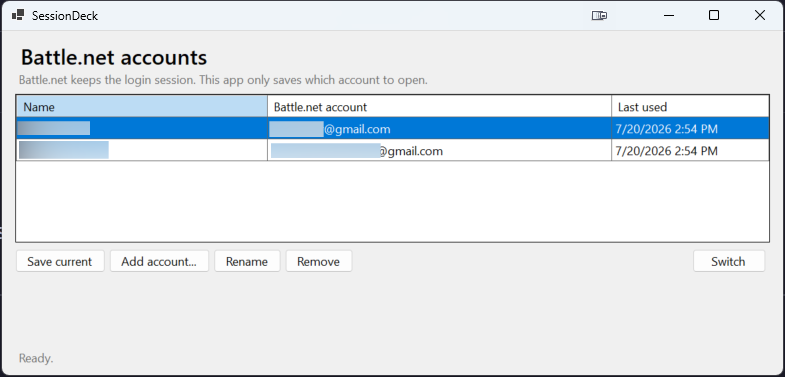

# SessionDeck

SessionDeck is a portable Windows 11 x64 app for switching between Battle.net accounts that Battle.net has already kept signed in. The download is one self-contained `SessionDeck.exe`; there is no installer and no separate .NET runtime to install.

> **Work in progress:** SessionDeck is still under development. Features and saved-data formats may change. Keep access to your account recovery methods and report any problems you find.



SessionDeck is an independent project and is not affiliated with or endorsed by Blizzard Entertainment.

## Contents

- [How to use](#how-to-use)
- [Download](#download)
- [What SessionDeck does](#what-sessiondeck-does)
- [Data and privacy](#data-and-privacy)
- [Troubleshooting](#troubleshooting)
- [Build from source](#build-from-source)
- [Development and releases](#development-and-releases)
- [Planned features](TODO.md)
- [License](#license)

## How to use

### Save your first account

1. Open Battle.net and sign in to the account you want to save.
2. Enable **Stay logged in** in Battle.net.
3. Open `SessionDeck.exe`.
4. Click **Save current**.
5. Enter a name that will help you recognize the account, then click **Save**.

### Add another account

1. In SessionDeck, click **Add account...**.
2. Confirm that Battle.net may close and reopen.
3. Sign in to the other account and enable **Stay logged in**.
4. Return to SessionDeck and click **Save current**.
5. Give the account a name and save it.

Repeat these steps for each account you want to add.

### Switch accounts

Select an account and click **Switch**, or double-click the account. SessionDeck closes Battle.net, puts that account first in Battle.net's saved account list, and starts Battle.net again.

Use **Rename** to change the name shown in SessionDeck. Use **Remove** to remove an entry from SessionDeck; this does not delete the Battle.net account.

## Download

Download [`SessionDeck.exe`](https://github.com/slatkisasa/sessiondeck/releases/latest/download/SessionDeck.exe) from the [latest GitHub release](https://github.com/slatkisasa/sessiondeck/releases/latest). The app currently supports Windows 11 x64.

The release is self-contained and includes the .NET Desktop Runtime and Windows Forms libraries. This is why the file is larger than the app's own code. You do not need administrator access, an installer, or a separate .NET download.

SessionDeck is not currently code-signed, so Windows may show a SmartScreen warning. Only download it from this repository. You can also download [`checksums-sha256.txt`](https://github.com/slatkisasa/sessiondeck/releases/latest/download/checksums-sha256.txt) and compare the published checksum in PowerShell:

```powershell
Get-FileHash .\SessionDeck.exe -Algorithm SHA256
Get-Content .\checksums-sha256.txt
```

The two SHA-256 values should match.

## What SessionDeck does

Battle.net keeps authenticated sessions itself. SessionDeck does **not** save passwords, authentication tokens, cookies, browser data, or a full copy of the launcher profile.

SessionDeck reads account identifiers that Battle.net has already written to `%APPDATA%\Battle.net\Battle.net.config`. When you switch accounts, it safely moves the selected identifier to the front of `Client.SavedAccountNames`, then restarts Battle.net. Other Battle.net settings are kept unchanged.

Before changing the Battle.net configuration, SessionDeck creates a backup in `%LOCALAPPDATA%\SessionDeck\Backups`.

## Data and privacy

SessionDeck stores only the information needed to show and select your saved accounts:

- Account names and Battle.net account identifiers: `%LOCALAPPDATA%\SessionDeck\accounts.json`
- Battle.net configuration backups: `%LOCALAPPDATA%\SessionDeck\Backups`

SessionDeck does not collect passwords, make network calls, send telemetry, or use auto-fill. It runs as your current Windows user and does not request administrator access.

The account identifier may be an email address. Anyone who can read your Windows user files may be able to see it in `accounts.json`, so protect your Windows account and do not share that file publicly.

## Troubleshooting

### An account opens at the sign-in screen

Battle.net may have expired its saved session. Sign in normally, enable **Stay logged in**, and use **Save current** again.

### Save current cannot find an account

Finish signing in to Battle.net first. Close Battle.net, reopen SessionDeck, and try **Save current** again.

### The buttons are unavailable

SessionDeck needs to find both the Battle.net configuration and launcher. Make sure Battle.net is installed and has been opened at least once.

### I want to remove SessionDeck

Delete `SessionDeck.exe`. If you also want to remove its saved names and backups, delete `%LOCALAPPDATA%\SessionDeck`. This does not uninstall Battle.net or delete a Battle.net account.

If you find a problem, open a [GitHub issue](https://github.com/slatkisasa/sessiondeck/issues) and describe what happened. Do not include passwords, authentication data, or an unedited copy of your Battle.net configuration.

## Build from source

Building from source requires the [.NET 8 SDK](https://dotnet.microsoft.com/download/dotnet/8.0). People using the release executable do not need the SDK or runtime.

From PowerShell, run:

```powershell
.\build.ps1
```

The self-contained Windows x64 executable is written to `dist\SessionDeck.exe`.

Run the built-in non-destructive tests with:

```powershell
.\.dotnet-sdk\dotnet.exe run --project .\SessionDeck.csproj -- --self-test
```

The tests use temporary files and do not touch the live Battle.net configuration.

## Development and releases

Changes are developed on short-lived branches such as `feat/tray-menu`, `fix/window-resize`, or `hotfix/session-restore`, then merged into `main` through pull requests.

Pull request titles use Conventional Commit format. Release Please uses those titles to update `CHANGELOG.md`, choose the next semantic version, and open a release pull request. Merging the release pull request creates a GitHub Release with the changelog, `SessionDeck.exe`, and `checksums-sha256.txt`.

See [CONTRIBUTING.md](CONTRIBUTING.md) for the full branch, pull request, and release process. Planned improvements are listed in [TODO.md](TODO.md).

## License

Copyright © 2026 [slatkisasa](https://github.com/slatkisasa).

SessionDeck is licensed under the [GNU Affero General Public License v3.0](LICENSE.md). You may use, modify, and distribute it, including commercially, provided you follow the license. Copyright and license notices must remain intact, and covered modifications must make their corresponding source available under the same license.
